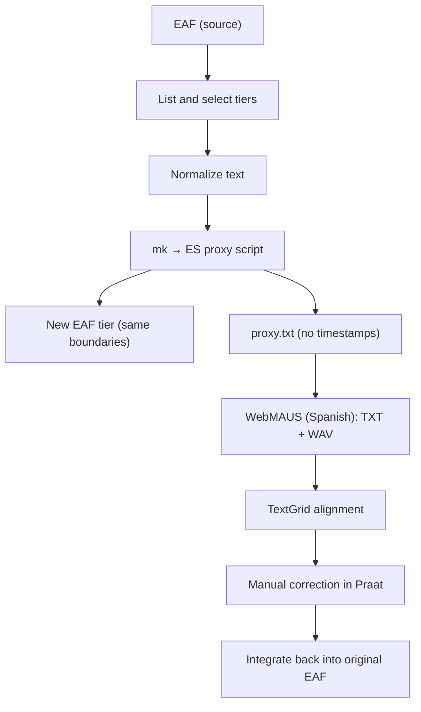

# macedonian
Scripts and data workflow for phonetic alignment, annotation and formant extraction in an oral corpus of Macedonian folk tales

# Workflow: ELAN EAF → Spanish-like proxy text → WebMAUS → TextGrid → back to EAF

**Goal.** Align Macedonian speech when a direct Macedonian G2P is unavailable. We convert a source ELAN tier into a Spanish-like proxy orthography designed to be robust with WebMAUS-Spanish, obtain a TextGrid alignment, then reintegrate the timing into the original EAF.

---

## Steps

1. **Inspect and select tiers**
   - Open the `.eaf` file and list tiers.
   - Identify the source tier to convert (Cyrillic Macedonian or already Latin transliteration).
   - Optionally pick an auxiliary Latin tier for cross-checking.

2. **Normalize text**
   - Clean up punctuation and unify whitespace.
   - If the tier is in **Cyrillic**, transliterate letter-by-letter to Latin, then apply **Spanish-like mapping** (`mk_to_es_proxy` rules below).
   - If the tier is already in **Latin**, directly apply the Spanish mapping.

3. **Generate two outputs**
   - A new **ELAN tier** with the proxy text, preserving the **exact annotation boundaries** of the source tier.
   - A plain **TXT file** with the concatenated proxy text (no timestamps, no sound marks), ready for WebMAUS.

4. **Run WebMAUS (Spanish)**
   - Go to [BAS WebMAUS Basic](https://clarin.phonetik.uni-muenchen.de/BASWebServices/interface/WebMAUSBasic).
   - Select **Spanish** as the processing language.
   - Upload the corresponding WAV and the proxy TXT.
   - Download the **Praat TextGrid** alignment.

5. **Post-edit alignment**
   - Manually correct the TextGrid in Praat if necessary.

6. **Reintegrate into ELAN**
   - Import or map the aligned intervals back into the original EAF.
   - You may keep the proxy tier as documentation or replicate the corrected boundaries into other tiers.

---

## Why use Spanish as a proxy?

According to the [official CLARIN-BAS WebMAUS documentation](https://clarin.phonetik.uni-muenchen.de/BASWebServices/help#IWantToExtendMausForANew(notYetSupported)LanguageWhatDataDoINeedForTheTraining), when no trained G2P model exists for a given language, a practical workaround is to **use an orthography and phoneme mapping close to a supported language**.  

Spanish is recommended because its **phoneme–grapheme correspondence is highly regular**, its **WebMAUS acoustic model is robust**, and the **phonetic inventory overlaps well** with many Indo-European systems.  
This method therefore leverages the Spanish G2P to generate approximate phone-level alignments for Macedonian, without requiring training data.

---

## Macedonian → Spanish-like proxy mapping

Simplified one-to-one rules prioritizing stability and G2P coverage.

| Macedonian | IPA | Proxy | Note |
|-------------|-----|--------|------|
| а | /a/ | a | — |
| е | /e/ | e | — |
| и | /i/ | i | — |
| о | /o/ | o | — |
| у | /u/ | u | — |
| п, б, т, д, к, г | /p b t d k ɡ/ | p, b, t, d, c/qu, g/gu | qu/gu before e,i |
| в | /v/ | v | — |
| ф | /f/ | f | — |
| с | /s/ | s | also replaces Macedonian /z/ |
| з | /z/ | s | /z/ merged as /s/ to keep it from being interpreted as /θ/ |
| ѕ | /dz/ | ds | /dz/ simplified to /ds/, as above |
| ц | /ts/ | ts | — |
| ч | /t͡ʃ/ | ch | — |
| џ | /d͡ʒ/ | y | — |
| ш | /ʃ/ | s | — |
| ж | /ʒ/ | y | — |
| х | /x/ | j | as in *jamón* |
| р | /r ~ ɾ ~ r̩/ | r / rr | Single phoneme; strong trill word-initially or after /n, l/; can be syllabic |
| л | /l/ | l | — |
| љ | /ʎ/ | ll | — |
| њ | /ɲ/ | ñ | — |
| ј | /j/ | y | — |
| ќ | /c/ | ky | — |
| ѓ | /ɟ/ | y | closest phoneme found, WebMAUS recognition performance to be evaluated |

---

## Files produced

- `source.eaf` → `source_with_proxy.eaf` (adds new tier, same timing)
- `proxy.txt` (WebMAUS input)
- `aligned.TextGrid` (from WebMAUS, manually corrected)

---

## Reproducibility

All transformations are performed with a single Python script (Colab-ready) using `pympi-ling` for EAF I/O and pure-Python mappings.

---

