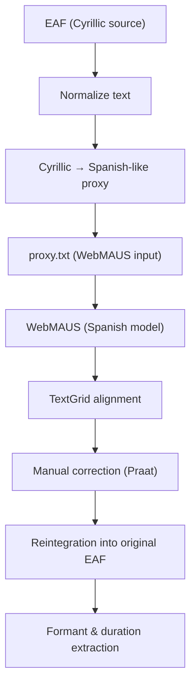

# Macedonian
Scripts and data workflow for **phonetic alignment, annotation and formant extraction** in an oral corpus of Macedonian folk tales collected and analyzed by [Izabela Jordanoska](https://www.mpi.nl/people/jordanoska-izabela).

---

## Workflow: EAF → Cyrillic text → Spanish-like proxy → WebMAUS → TextGrid → back to EAF

**Goal.**  
Obtain phone-level alignments for Macedonian speech **when no native G2P exists**.  
Each Cyrillic tier is converted directly into a **Spanish-like proxy orthography**, aligned with WebMAUS (Spanish model), and merged back into the original ELAN file.

---

## Steps

1. **Extract and inspect tiers**
   - Load `.eaf` files from `/data/eaf/` and inspect tier names.
   - Identify the **source text tier** (Cyrillic).
   - Optionally check a Latin transliteration tier for consistency.

2. **Generate normalized text**
   - Remove punctuation, unify whitespace.
   - Work directly from the **Cyrillic transcription** (no Latin intermediary).
   - Apply direct **Cyrillic → Spanish-like proxy** mapping.

3. **Output generation**
   - For each `.eaf`, produce:
     - a **proxy TXT** (`.txt`) ready for WebMAUS input;
     - an optional **EAF copy** with a new proxy tier preserving timing.

4. **Run WebMAUS (batch mode on Colab)**
   - The notebook automatically iterates over all `.wav` and `.txt` pairs in `/media/` and `/out_txt_proxy/`.
   - Calls [BAS WebMAUS Basic](https://clarin.phonetik.uni-muenchen.de/BASWebServices/interface/WebMAUSBasic) with:
     - `LANGUAGE=spa`
     - `OUTSYMBOL=ipa`
   - Timeout extended to 10–15 minutes for long files.
   - Produces `.TextGrid` files in `/macedonian/data/textgrid/`.

5. **Push and versioning**
   - Colab cell pushes updated `.TextGrid` and `.txt` files to GitHub (`data/textgrid`, `data/proxy_esp`).
   - Existing files are preserved (no overwrite).

6. **Alignment verification**
   - Manual checking in Praat or ELAN.
   - Priority on vowel alignment (/e, a, i, o, u/).
   - Next steps: duration, formant tracking (F1–F3), contextual comparisons.

---

## Why use Spanish as a proxy?

When no Macedonian G2P exists, **Spanish** offers a practical phonographic surrogate:

- transparent grapheme–phoneme mapping,  
- stable WebMAUS acoustic model,  
- broad overlap with Macedonian phoneme inventory.

As recommended by [CLARIN-BAS](https://clarin.phonetik.uni-muenchen.de/BASWebServices/help#IWantToExtendMausForANew(notYetSupported)LanguageWhatDataDoINeedForTheTraining), a supported language can be used as proxy if the mapping is carefully controlled.

---

## Macedonian → Spanish-like proxy mapping

Direct mapping from **Cyrillic to proxy**, optimized for WebMAUS-Spanish.  
Special handling for palatalized consonants and qu/gu contexts.

| Macedonian | Latin | IPA | Proxy | Notes |
|-------------|--------|-----|--------|-------|
| а | a | /a/ | a | — |
| е | e | /e/ | e | — |
| и | i | /i/ | i | — |
| о | o | /o/ | o | — |
| у | u | /u/ | u | — |
| п, б, т, д | p, b, t, d | /p b t d/ | same | — |
| к | k | /k/ | k | stable everywhere |
| г | g | /ɡ/ | g / gu (before e,i) | `guie`, `gui` to prevent /xi/ |
| ќ | — | /c/ | ky | palatalized /kʲ/ (e.g. ќе → *kye*) |
| ѓ | — | /ɟ/ | guie | palatalized /gʲ/ (e.g. ѓе → *guie*) |
| ж | ž | /ʒ/ | y | — |
| ш | š | /ʃ/ | s | — |
| ч | č | /t͡ʃ/ | ch | — |
| џ | dž | /d͡ʒ/ | ds | /ds/ avoids voiced /ʒ/-like readings |
| ѕ | dz | /dz/ | ds | — |
| з | z | /z/ | s | merged as /s/ to avoid /θ/ |
| с | s | /s/ | s | — |
| х | h | /x/ | j | Spanish /x/ as in *jamón* |
| ј | j | /j/ | y | — |
| љ | lj | /ʎ/ | ll | — |
| њ | nj | /ɲ/ | ñ | — |
| р | r | /r ~ ɾ/ | r / rr | context-dependent |
| л | l | /l/ | l | — |
| м, н | m, n | /m n/ | same | — |
| в | v | /v/ | v | — |
| ф | f | /f/ | f | — |

---

## Files produced

- `*.eaf` → `*_proxy.eaf` (adds proxy tier)
- `out_txt_proxy/*.txt` — Spanish-like proxy text
- `data/textgrid/*.TextGrid` — WebMAUS-aligned output

---

## Reproducibility and automation

- Python 3.10+ (Colab environment)
- Dependencies: `pympi-ling`, `requests`, `lxml`
- Automatic batch alignment + retry mechanism for long files
- Push utility for synchronizing outputs to GitHub

All intermediate files remain available in `/content/macedonian/data/` for traceability.

---

```mermaid
flowchart TD
  A["EAF (Cyrillic source)"]
  B["Normalize text"]
  C["Cyrillic → Spanish-like proxy"]
  D["proxy.txt (WebMAUS input)"]
  E["WebMAUS (Spanish model)"]
  F["TextGrid alignment"]
  G["Manual correction (Praat)"]
  H["Reintegration into original EAF"]
  I["Formant & duration extraction"]

  A --> B --> C --> D --> E --> F --> G --> H --> I
```

### Repository structure

macedonian/
│
├── data/
│   ├── eaf/                # original ELAN files
│   ├── proxy_esp/          # generated Spanish-like TXT proxies
│   └── textgrid/           # WebMAUS-aligned TextGrids
│
├── media/                  # WAV files (mono, 16kHz)
├── notebooks/
│   └── EAF2MAUS.ipynb      # main Colab notebook
│
└── README.md

### Known issues / Future work

**Timeouts on long files**
WebMAUS Basic occasionally times out for >10-minute recordings. Current workaround: extended timeout (900 s) and selective re-submission.

**Palatal and affricate handling**
The `/kʲ/` → ky and `/gʲ/` → guie mappings are effective but occasionally produce spurious glide insertions. Context-sensitive refinement is planned.

**Automated EAF reintegration**
Current reintegration from TextGrid back to EAF is manual. A conversion utility (TextGrid → Tier) is under development.

**Formant and duration extraction**
Next stage will include batch formant tracking (Praat/Parselmouth) for vowel comparisons, focusing on `/e/` tokens within rece vs. other lexical contexts.

### Citation / Reference

If you use or adapt this workflow, please cite:

> Contreras Roa, L., & Jordanoska, I. (2025). Proxy-based phonetic alignment for Macedonian using WebMAUS-Spanish.
> GitHub repository: lcontrerasroa/macedonian

You may also reference this repository in HAL or Zenodo once archived:
@misc{contrerasroa2025macedonian,
  author       = {Leonardo Contreras Roa and Izabela Jordanoska},
  title        = {Macedonian: Proxy-based phonetic alignment for Macedonian using WebMAUS-Spanish},
  year         = {2025},
  publisher    = {GitHub},
  howpublished = {\url{https://github.com/lcontrerasroa/macedonian}},
  note         = {Université de Picardie Jules Verne (EA 4295 CORPUS – LASO)}
}

**Leonardo Contreras Roa**
*Université de Picardie Jules Verne*

